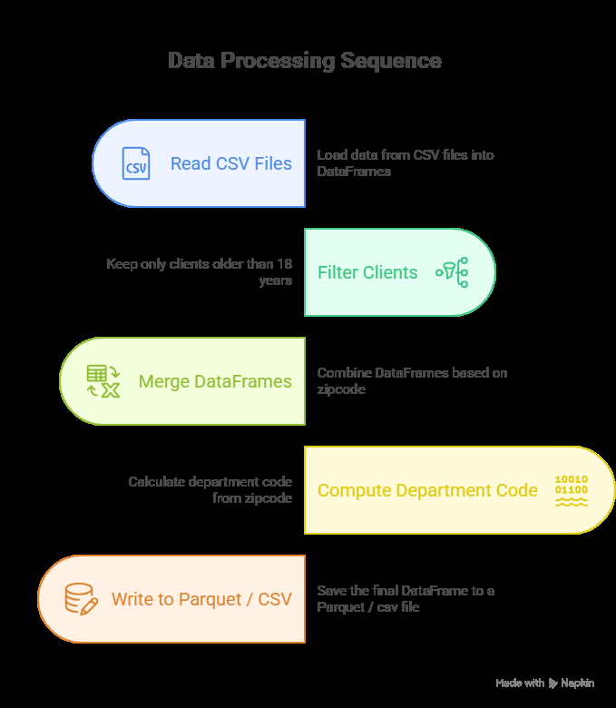

# 📊 Client Data Analysis by Zip Code



## 🚀 Overview

This project enables the analysis of client data based on age and location. It processes client information, associates it with geographical zip code data, and generates detailed analyses by department. The project supports multiple data processing backends including **pandas**, **polars**, and **PySpark** for optimal performance at any scale.

## ✨ Features

- **Multi-Engine Support**:
  - Seamless integration with **pandas**, **polars**, and **PySpark**
  - Automatic type inference and conversion between frameworks

- **Data Processing**:
  - Filter clients based on age criteria
  - Enrich data with geographical information
  - Aggregate data by department
  - Robust handling of missing or invalid data
  - Type-safe operations with Python type hints

- **Input/Output**:
  - Load data from CSV files
  - Export results in various formats
  - Automatic output directory creation
  - Configurable file paths and output formats

- **Quality & Testing**:
  - Comprehensive unit tests with pytest
  - Static typing for better code quality
  - Continuous Integration with GitHub Actions
  - Code coverage reports

## 📁 Project Structure

```
.
├── .github/
│   └── workflows/
│       └── build.yml          # GitHub Actions CI/CD Configuration
├── src/
│   └── country_age_analyses/
│       ├── resources/         # Reference data
│       ├── scripts/           # Processing scripts
│       │   └── data_processing.py
│       ├── utils/             # Utilities
│       │   ├── custom_logger.py
│       │   └── __init__.py
│       ├── __init__.py
│       └── main.py            # Main entry point
├── tests/                     # Automated tests
│   ├── resources/
│   ├── test_data_processing.py
│   └── test_export_data.py
├── .gitignore
├── pyproject.toml            # Project configuration
├── README.md                 # This file
└── requirements.txt          # Dependencies
```

## 🚀 Installation

### Prerequisites

- Python 3.8+
- pip (Python package manager)
- Git

### Setup

1. Clone the repository:
   ```bash
   git clone https://github.com/djeFerroudja/customer-data-pipeline.git
   cd customer-data-pipeline
   ```

2. Create and activate a virtual environment (recommended):
   ```bash
   python -m venv .venv
   .\.venv\Scripts\activate
   ```

3. Install dependencies:
   ```bash
   pip install -r requirements.txt
   ```
   
3. Install package:
   ```bash
   pip install -e .
   
   ```
## 🏃‍♂️ Usage

### Running the Main Program

To start data analysis:
```bash
python -m country_age_analyses.main
```
```-m country_age_analyses.main``` tells Python to execute the main module.

```--engine``` selects the data processing engine (polars or pandas)

#### Example
Default (uses pandas)
```-m country_age_analyses.main```

Explicitly using polars
```country_age_analyses --engine=polars```

### Running Tests

Run all tests:
```bash
pytest
```

Generate coverage report:
```bash
pytest --cov=src
```

### Development

Before submitting code, run these commands to ensure quality:

```bash
# Code style checking
pylint src tests

# Code formatting
black src tests

# Type checking
mypy src
```

## 🔧 Configuration

Main parameters can be modified in `main.py`:
- Input file paths
- Output directories
- Age threshold for filtering
- Output formats

## 🤝 Contributing

1. Fork the repository
2. Create your feature branch (`git checkout -b feature/AmazingFeature`)
3. Commit your changes (`git commit -m 'Add some AmazingFeature'`)
4. Push to the branch (`git push origin feature/AmazingFeature`)
5. Open a Pull Request

## 📧 Contact

Ferroudja DJELLALI - [ferroudja.djellali@gmail.com]